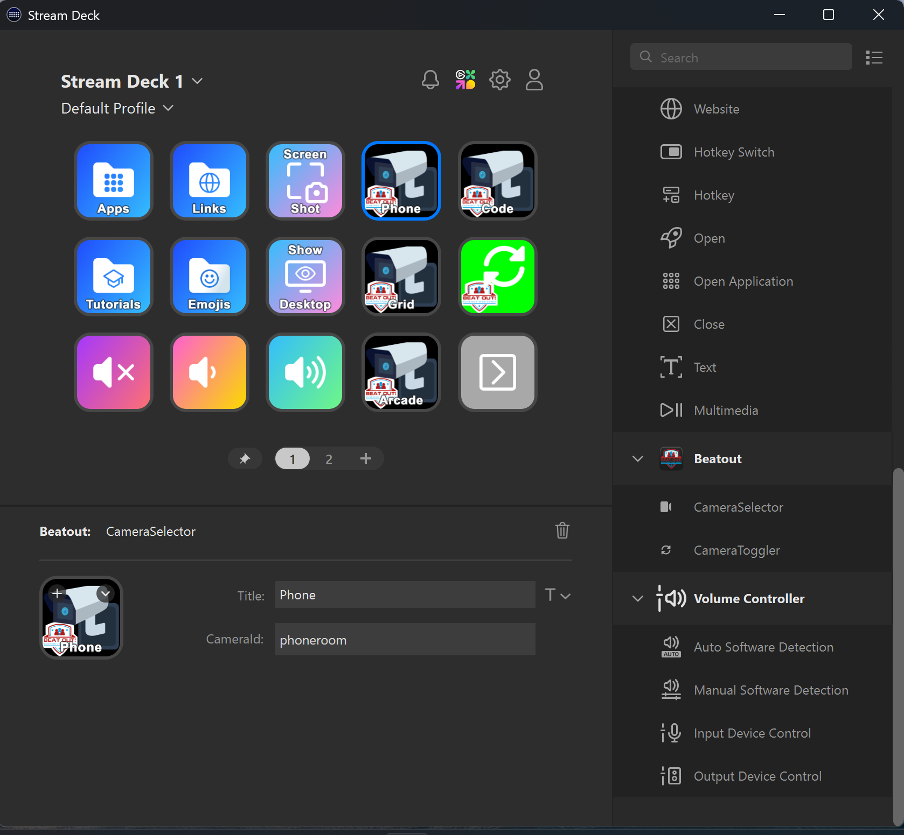

# beatout_streamdeck
Deze repository bevat 2 uitgewerkte usecases van de streamdeck voor Beatout.
- Gebruik om het dashboard to controleren, zoals het selecteren van de cameras (Windows)
- Gebruik als Sensor als keybaord input voor Beatout (Raspberry pi)

# Installatie

## Windows (Dashboard control)

1. Download en installeer de [Streamdeck software](https://www.elgato.com/ww/en/s/downloads).
2. Installeer de plugin in de folder plugin/beatout/com.kokima.beatout.streamDeckPlugin.
3. Maak een knop voor elke camera die je wilt selecteren. Parameters zijn naam van de kamer en room_id
4. In de frontend is een pull request klaar gemaakt die de integratie van de frontend kant afhandeld.
5. Na het mergen van de pull request, kun je de streamdeck gebruiken door in de navigatiebalk de streamdeck te connecteren.

## Raspberry Pi (Sensor als keyboard input)
De folder raspberry_pi bevat een uitgewerkt voorbeeld van hoe je de streamdeck kunt gebruiken als keyboard input voor Beatout op een Raspberry Pi.
Hierbij kun je bepalen welke knoppen op de streamdeck welke toetsenbord input geven, die vervolgens in Beatout gebruikt kunnen worden als sensor input.
